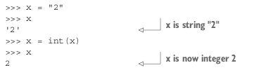

## 1.3 What Python doesn’t do as well

Although Python has many advantages, no language can do everything, so Python isn’t the perfect solution for all your needs. To decide whether Python is the right language for your situation, you also need to consider the areas where Python doesn’t do as well.

### 1.3.1 Python isn’t the fastest language

A possible drawback with Python is its speed of execution. It isn’t a fully compiled language. Instead, it’s first compiled to an internal bytecode form, which is then executed by a Python interpreter. There are some tasks, such as string parsing using regular expressions, for which Python has efficient implementations and is as fast as,or faster than, any C program you’re likely to write. Nevertheless, most of the time,using Python results in slower programs than in a language like C. **But you should keep this in perspective. Modern computers have so much computing power that for the vast majority of applications, the speed of the program isn’t as important as the speed of development, and Python programs can typically be written much more quickly.** In addition, it’s easy to extend Python with modules written in C or C++, which can be used to run the CPU-intensive portions of a program.

### 1.3.2 Python doesn’t have the most libraries

Although Python comes with an excellent collection of libraries, and many more are available, Python doesn’t hold the lead in this department. Languages like C, Java, and Perl have even larger collections of libraries available, in some cases offering a solution where Python has none or a choice of several options where Python might have only one. These situations tend to be fairly specialized, however, and Python is easy to extend, either in Python itself or through existing libraries in C and other languages. For almost all common computing problems, Python’s library support is excellent.

### 1.3.3 Python doesn’t check variable types at compile time

Unlike in some languages, Python’s variables don’t work like containers; instead, they’re more like labels that reference various objects: integers, strings, class instances, whatever. That means that although those objects themselves have types, the variables referring to them aren’t bound to that particular type. It’s possible (if not necessarily desirable) to use the variable x to refer to a string in one line and an integer in another:

**The fact that Python associates types with objects and not with variables means that the interpreter doesn’t help you catch variable type mismatches.** If you intend a variable count to hold an integer, Python won’t complain if you assign the string "two" to it. Traditional coders count this as a disadvantage, because you lose an additional free check on your code. But errors like this usually aren’t hard to find and fix, and Python’s testing features makes avoiding type errors manageable. Most Python programmers feel that the flexibility of dynamic typing more than outweighs the cost.

